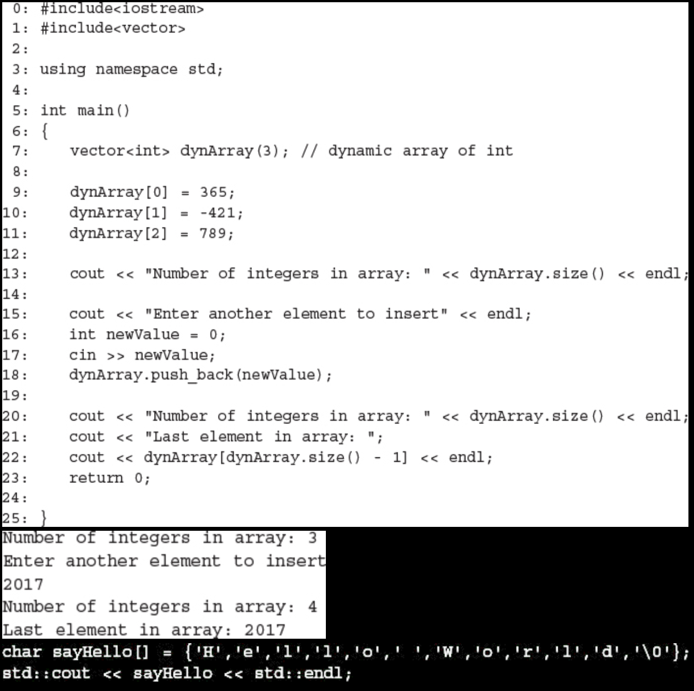

# Workshop

## Quiz
1. Check the array myNumbers in Listing 4.1. What are the indexes of the first and last elements in that array?
#### Listing 4.4 Creating a Dynamic Array of Integers and Inserting Values Dynamically

2. If you needed to allow the user to input strings, would you use C-style strings?

3. How many characters does the compiler see in '\0'?

4. You forget to end your C-style string with a null terminator. What happens when you use it?

5. See the declaration of `vector` in Listing 4.4 and try composing a dynamic array that contains elements of the type `char`.

### Answers
1. 0 and 4 are the zero-based indexes of the first and last elements of an array with five elements.

2. No, I would not use C-style strings if I needed a user to input strings. This is because I wouldn't want the user or a line of code to write an additional null terminator character. Also this would give the user an opportunity to enter a string longer than the lenght of the array.

3. The compiler sees '\0' as a single character.

4. If you use it in a cout statement, the display logic reads successive characters, seeking a terminating null, and crosses the bounds of the array, possibly causing your applicaiton to crash.

5. `vector<char> dynArr(3); // dynamic array of char`